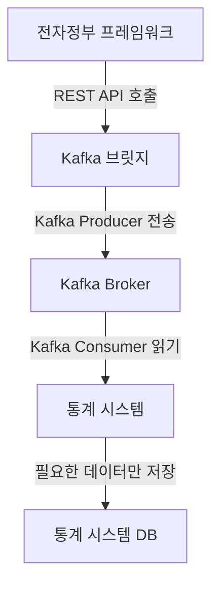

# 📌 Kafka 기반 통계현황 시스템 도입 제안

## ✅ 1. 개요
현재 운영 서비스에서 데이터를 수집하여 통계를 제공하는 시스템을 구축 중입니다. 기존 REST API Polling 방식은 **API 부하 증가, 실시간성 부족, 중복 데이터 문제** 등의 한계를 가지고 있으며, 이러한 문제를 해결하고자 **Apache Kafka** 기반의 데이터 스트리밍 방식을 도입하는 방안을 검토하고 있습니다.

Kafka는 **고성능 분산 메시징 시스템**으로, 운영 서비스에서 발생하는 이벤트 데이터를 **비동기적으로 처리하여 통계 시스템에 실시간 반영**할 수 있는 구조를 제공합니다. 이를 통해 **운영 서비스의 부담을 줄이면서, 보다 신속하고 정확한 데이터 분석이 가능**해집니다.

---

## ✅ 2. 기존 방식의 문제점 (Polling 기반 데이터 수집)

현재 운영 서비스에서 데이터를 가져오는 방식은 **주기적인 API 호출(Polling)**을 기반으로 합니다. 하지만 이 방식은 여러 가지 한계를 가지고 있습니다.

### 📌 **기존 방식의 주요 문제점**
| 문제점 | 설명 |
|--------|------|
| 🚨 **API 부하 증가** | 운영 서비스에 일정 주기로 API 요청을 보내야 하므로 서버 부하가 증가 |
| ⏳ **실시간성 부족** | Polling 주기에 따라 데이터 반영이 지연되며, 즉각적인 통계 반영이 어려움 |
| 📉 **중복 데이터 요청** | 같은 데이터를 여러 번 요청하게 되어 불필요한 중복 처리 발생 |
| 🔗 **운영 서비스와의 강한 결합** | API 요청을 지속적으로 보내야 하므로 운영 서비스와 통계 시스템 간의 종속성이 높음 |

---

## ✅ 3. Kafka 도입의 필요성 및 장점

Kafka를 도입하면 **운영 서비스에서 발생하는 데이터를 이벤트 기반으로 처리**할 수 있으며, Polling 방식보다 **빠르고 효율적인 데이터 스트리밍이 가능**합니다.

### 📌 **Kafka 도입의 주요 장점**
| 장점 | 설명 |
|------|------|
| 🚀 **실시간 데이터 처리** | 운영 서비스에서 이벤트 발생 즉시 Kafka로 데이터 전송 후 소비 가능 |
| ⚡ **고성능 & 확장성** | 초당 **수백만 건의 데이터 처리 가능**, 다수의 Consumer가 데이터를 동시에 처리 |
| 🔄 **운영 서비스 부하 감소** | 운영 서비스가 Kafka에 데이터만 보내면 되므로, API 요청 부담이 사라짐 |
| 🔗 **운영 서비스와의 결합도 낮춤** | 통계 시스템이 운영 서비스 API를 직접 호출하지 않고 Kafka에서 데이터를 구독 |
| 🔧 **유연한 데이터 활용 가능** | 특정 시간대 통계, 이벤트 기반 분석 등 다양한 형태의 데이터 처리 가능 |
| 🛡 **데이터 유실 방지** | Kafka는 데이터 저장 후 여러 Consumer가 가져갈 수 있어 안정적인 데이터 보장 |

---

## ✅ 4. Kafka 기반 통계 시스템 아키텍처

### 📌 **Kafka를 활용한 데이터 흐름**

### 📌 **Kafka 동작 방식**
1️⃣ **운영 서비스 (Producer)**:
- 사용자 활동 데이터, 주문 데이터, 시스템 이벤트 발생 시 **Kafka로 데이터를 전송**
- 운영 서비스는 단순히 Kafka로 메시지를 보내기만 하면 됨 → **API 부하 최소화**

2️⃣ **Kafka Broker**:
- 데이터를 **토픽(Topic)** 단위로 저장
- 여러 Consumer가 동시에 데이터를 처리 가능

3️⃣ **Kafka Consumer (통계 시스템)**:
- 운영 서비스에서 Kafka로 전송한 데이터를 실시간으로 가져와 **분석 및 가공 후 저장**
- **통계 DB에 저장 후 사용자에게 제공**

4️⃣ **통계 DB → 대시보드**:
- 가공된 데이터를 데이터베이스에 저장한 후, 사용자가 조회할 수 있도록 제공
- 대시보드에서 실시간 데이터 업데이트 가능

---

## ✅ 5. 기존 방식 vs Kafka 방식 비교

### 📌 **Polling 방식과 Kafka 방식의 차이점**
| 비교 항목 | 기존 방식 (REST API Polling) | Kafka 방식 |
|-----------|------------------------|-------------|
| **실시간성** | ❌ 일정 주기로 데이터 요청 → 지연 발생 | ✅ 이벤트 발생 즉시 데이터 반영 |
| **운영 서비스 부하** | ❌ 많은 API 요청 발생 | ✅ 운영 서비스는 Kafka로 데이터 전송 후 종료 |
| **중복 데이터 요청** | ❌ 같은 데이터를 여러 번 요청 가능 | ✅ Kafka에서 필요한 데이터만 가져감 |
| **확장성** | ❌ 운영 서비스마다 추가 API 요청 필요 | ✅ 다수의 Consumer가 데이터를 동시에 처리 가능 |
| **데이터 안정성** | ❌ API 장애 시 데이터 손실 가능 | ✅ Kafka에서 데이터 보존 후 Consumer가 가져감 |

---

## ✅ 6. Kafka 도입 시 기대 효과

1️⃣ **운영 서비스 부하 감소**
- 기존 API Polling 방식과 달리, **운영 서비스는 단순히 Kafka로 데이터를 보내기만 하면 끝!**
- API 요청 부담이 사라지고, 운영 서비스 성능이 개선됨

2️⃣ **실시간 데이터 처리 가능**
- 기존에는 Polling 주기(예: 1~5분) 동안 대기해야 했지만,  
  **Kafka를 활용하면 이벤트 발생 즉시 데이터 반영 가능!**

3️⃣ **유연한 데이터 활용**
- 운영 서비스와 직접적인 API 호출 없이, **다양한 Consumer가 데이터를 활용**
- 통계 시스템, 모니터링 시스템, 데이터 분석 플랫폼 등 다양한 곳에서 활용 가능

4️⃣ **확장성 보장**
- 데이터 양이 많아질수록 API Polling 방식은 **부하가 커지고 성능 저하 발생**
- Kafka는 **분산 아키텍처를 지원**하므로, 데이터가 많아져도 처리 성능 유지 가능

---

## ✅ 7. 결론 및 제안

Kafka를 도입하면 **운영 서비스 부하를 줄이고, 실시간 통계 제공이 가능**합니다.  
이를 통해 **더 빠르고 효율적인 데이터 분석 환경을 구축할 수 있습니다.**

💡 **제안 사항**  
1️⃣ **단계적 도입**: 일부 운영 서비스에서 Kafka 기반 데이터 스트리밍을 먼저 적용 후 확대  
2️⃣ **테스트 환경 구축**: Kafka 기반 데이터 처리 성능 비교 후 검증 진행  
3️⃣ **운영 서비스 협의**: Kafka Producer 연동 방안을 논의하여 최소한의 개발 변경으로 적용 가능하도록 조정

---

## 🎯 **Kafka를 도입하면 통계 시스템이 더 강력해집니다!**
### 🚀 **운영 서비스 부하 없이, 실시간 통계 제공 가능!**
### 📊 **대량 데이터 처리 & 확장성 보장!**
### 🔄 **운영 시스템과의 결합도 낮추고 유지보수 편리!**

